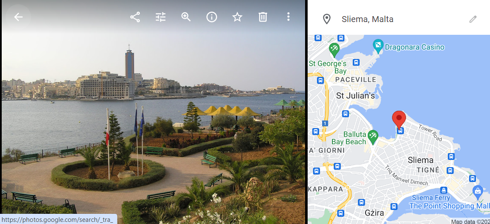

# Photo Mapper

This Angular app enables users to assign GPS coordinates to JPEG pictures by pinpointing their location on Google Maps, adding a GPS section to the image metadata. The application can be accessed via the URL https://photo-mapper-410703.appspot.com.

I utilized this app to add GPS coordinates to the photos I took in the pre-GPS era :) e.g.

